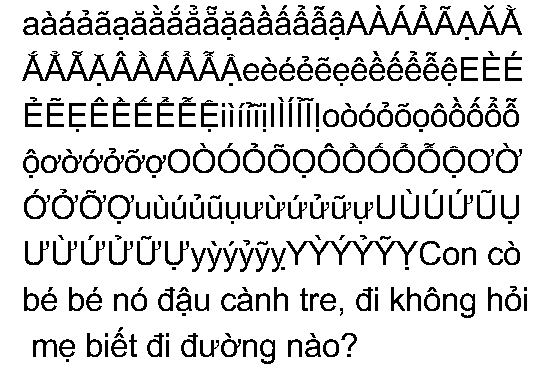
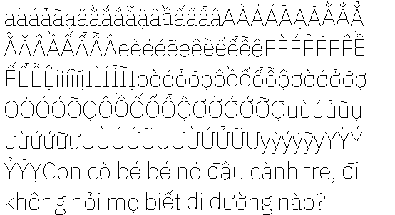
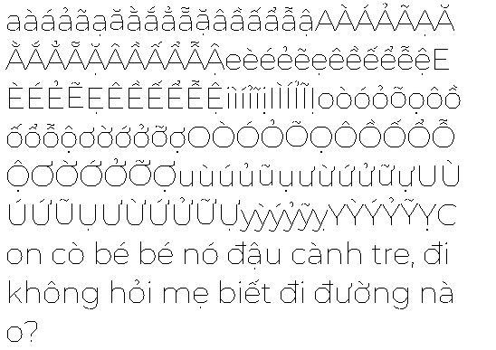
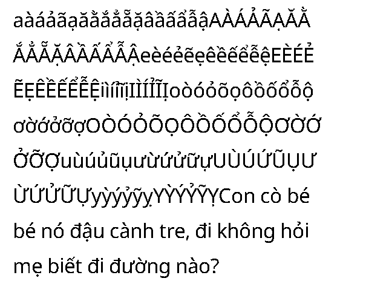
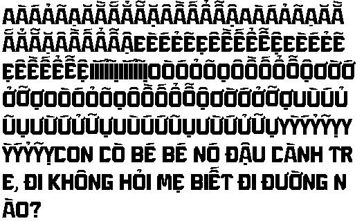

# U8G2 Vietnamese Fonts

Bộ font miễn phí hỗ trợ các ký tự Tiếng Việt tương thích với thư viện U8G2.

This repository contains pre-made Vietnamese fonts to be used with U8G2 library.

## Cách dùng

Anh em có thể copy font cần dùng trong folder `fonts/c/` vào project của anh em. Sau đó, trong source code chính (eg. main.c) cần khai báo extern cho font.

Ví dụ, tôi cần dùng font u8g2_font_arial_5pt. Tôi sẽ copy file `fonts/c/arial/u8g2_font_arial_regular_5pt.c` vào project của tôi. Sau đó, trong main.c, khai báo extern:

```c
extern const uint8_t u8g2_font_arial_5pt[3652] U8G2_FONT_SECTION("u8g2_font_arial_5pt");
```

Và cuối cùng, thì pass `u8g2_font_arial_5pt` vào các hàm của thư viện u8g2 để dùng thôi.

**Thông tin thêm**:
 - Để dùng bộ font này với Adafruit_GFX thì anh em cần sử dụng thêm bộ thư viện sau:
https://github.com/olikraus/U8g2_for_Adafruit_GFX
 - Hỗ trợ kích thước font: 5, 6, 7, 8, 10, 12, 14, 16, 18, 20, 24, 28, 32, 36, 40, 48, 56, 64.
 - **Repository này bao gồm các phông chữ miễn phí (tôi nghĩ vậy). Nếu có bất kỳ vi phạm bản quyền nào, vui lòng thông báo cho tôi, và tôi sẽ xóa nó càng sớm càng tốt.**

#### Cách đóng góp

Chào đón mọi sự đóng góp của anh em! Anh em có thể đóng góp thêm các bộ font Tiếng Việt **miễn phí** mà anh em biết. Hạy tạo 1 branch và PR mới, đặt font (định dạng .ttf) vào folder `fonts/ttf`. Sau đó, chạy script `python3 ./scripts/make.py`. 

**Lưu ý**
 - Anh em nên rename tên font thành định dạng sau "{font_name}_{font_style}.ttf". `font_style` bao gồm: bold, italic, regular, etc (nếu không rõ font style thì anh em để none)

## Usage

You can copy the required font from the `fonts/c/` folder into your project. Then, in the main source code (e.g., `main.c`), you need to declare the font as `extern`.

For example, if I need to use the font `u8g2_font_arial_5pt`, I will copy the file `fonts/c/arial/u8g2_font_arial_regular_5pt.c` into my project. Then, in `main.c`, declare it as `extern`:

```c
extern const uint8_t u8g2_font_arial_5pt[3652] U8G2_FONT_SECTION("u8g2_font_arial_5pt");
```

Finally, pass u8g2_font_arial_5pt into the functions of the U8g2 library to use it.

**Additional Information**:
- To use this font collection with Adafruit_GFX, you need to include the following library: https://github.com/olikraus/U8g2_for_Adafruit_GFX
- Supported font sizes: 5, 6, 7, 8, 10, 12, 14, 16, 18, 20, 24, 28, 32, 36, 40, 48, 56, 64.
- **This repository includes free fonts (or so I believe). If there is any copyright infringement, please notify me, and I will remove it as soon as possible.**

#### How to contribute

Contributions are welcome! You can add more free Vietnamese fonts that you know. Create a new branch and submit a pull request (PR), placing the font file (in .ttf format) into the fonts/ttf folder. Then, run the script:

```bash
python3 ./scripts/make.py
```

**Note**:
- Please rename the font using the following format: {font_name}_{font_style}.ttf 
- Font styles include: bold, italic, regular, etc. (if you dont know the font style exactly, let it to be none)

## Used tools:

 - otf2bdf: 
    ```
    sudo apt-get install otf2bdf
    ```
 - bdfconv: https://github.com/olikraus/u8g2/tree/master/tools/font/bdfconv


## Font Preview (24pt version only)


 - [arial](#arial) -  | [regular](#arial)  
 - [ibmplex](#ibmplex) -  | [regular](#ibmplex)  
 - [montserrat](#montserrat) -  | [regular](#montserrat)  
 - [notosans](#notosans) -  | [regular](#notosans)  
 - [opensans](#opensans) -  | [bold](#opensans)   | [italic](#opensans_italic_24pt)   | [regular](#opensans_regular_24pt)  
 - [patriot](#patriot) -  | [bold](#patriot)   | [medium](#patriot_medium_24pt)   | [normal](#patriot_normal_24pt)   | [regular](#patriot_regular_24pt)  
 - [roboto](#roboto) -  | [bold](#roboto)   | [italic](#roboto_italic_24pt)   | [regular](#roboto_regular_24pt)   | [thinitalic](#roboto_thinitalic_24pt)   | [thin](#roboto_thin_24pt)  
 - [ubuntu](#ubuntu) -  | [regular](#ubuntu)  
 - [uvnbaisau](#uvnbaisau) -  | [regular](#uvnbaisau)  
 - [xuong](#xuong) -  | [regular](#xuong)  

------------------
### arial



------------------
### ibmplex



------------------
### montserrat



------------------
### notosans



------------------
### opensans


#### opensans_italic_24pt


#### opensans_regular_24pt


------------------
### patriot


#### patriot_medium_24pt


#### patriot_normal_24pt


#### patriot_regular_24pt


------------------
### roboto


#### roboto_italic_24pt


#### roboto_regular_24pt


#### roboto_thinitalic_24pt


#### roboto_thin_24pt


------------------
### ubuntu


------------------
### uvnbaisau


------------------
### xuong



