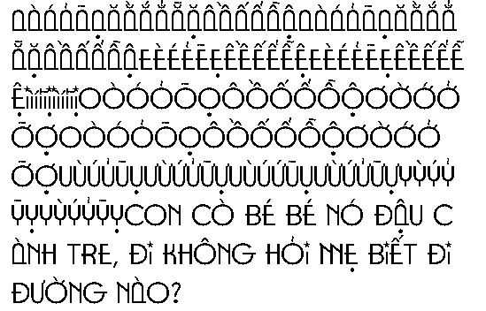

# U8G2 Vietnamese Fonts

This repository contains pre-made Vietnamese fonts to be used with U8G2 library.

Welcome friends' contribution for free fonts and improvement =)

Each font supports these sizes: 5, 6, 7, 8, 10, 12, 14, 16, 18, 20, 24, 28, 32, 36, 40, 48, 56, 64.

Used tools:

 - otf2bdf: 
    ```
    sudo apt-get install otf2bdf
    ```
 - bdfconv: https://github.com/olikraus/u8g2/tree/master/tools/font/bdfconv

## Font Preview (24pt version only)

 - [arial_24pt](#arial_24pt)
 - [ibmplex_24pt](#ibmplex_24pt)
 - [montserrat_24pt](#montserrat_24pt)
 - [notosans_24pt](#notosans_24pt)
 - [opensans_bold_24pt](#opensans_bold_24pt)
 - [opensans_italic_24pt](#opensans_italic_24pt)
 - [opensans_regular_24pt](#opensans_regular_24pt)
 - [patriot_bold_24pt](#patriot_bold_24pt)
 - [patriot_medium_24pt](#patriot_medium_24pt)
 - [patriot_normal_24pt](#patriot_normal_24pt)
 - [patriot_regular_24pt](#patriot_regular_24pt)
 - [roboto_bold_24pt](#roboto_bold_24pt)
 - [roboto_italic_24pt](#roboto_italic_24pt)
 - [roboto_regular_24pt](#roboto_regular_24pt)
 - [roboto_thin_24pt](#roboto_thin_24pt)
 - [roboto_thinitalic_24pt](#roboto_thinitalic_24pt)
 - [ubuntu_regular_24pt](#ubuntu_regular_24pt)
 - [uvn_baisau_24pt](#uvn_baisau_24pt)
 - [xuong_24pt](#xuong_24pt)

### arial_24pt


### ibmplex_24pt


### montserrat_24pt


### notosans_24pt


### opensans_bold_24pt


### opensans_italic_24pt


### opensans_regular_24pt


### patriot_bold_24pt


### patriot_medium_24pt


### patriot_normal_24pt



### patriot_regular_24pt


### roboto_bold_24pt


### roboto_italic_24pt


### roboto_regular_24pt


### roboto_thin_24pt


### roboto_thinitalic_24pt


### ubuntu_regular_24pt


### uvn_baisau_24pt


### xuong_24pt


